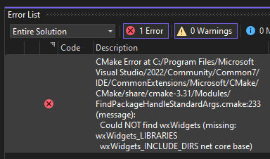
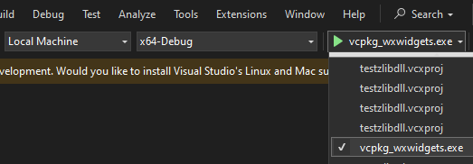

# Linear Algebra and wxWidgets Template

This project offers a template that combines wxWidgets with the Armadillo linear algebra library. It incorporates some optional Armadillo dependencies as well, including:
 * SuperLU
 * OpenBLAS
 * LAPACK

Armadillo uses Newarp as a replacement for ARPACK, so you can still get ARPACK functionality without installing ARPACK. Note that Newarp may not support some of ARPACK's functionality.

Note that OpenBLAS technically replaces LAPACK too, but the OpenBLAS package offered by vcpkg doesn't build LAPACK.

This project automatically downloads and builds the libraries as part of its CMake setup process, which happens automatically when the project is opened in Visual Studio 2022.

## Getting Started

These directions were tested on Windows 10.

### Install Required Software

You need the following software installed:
  * Git (must be on your system PATH)
  * Visual Studio 2022

**You can skip to the next section if you have these installed already.**

If you want to install them automatically, you can use this PowerShell script:
  * Press the Windows key, then type **PowerShell ISE**.
  * When PowerShell appears in the search list, choose **Run ISE as Administrator**.
  * PowerShell ISE opens. On the **File** menu, click **New**.
  * Copy and paste the PowerShell code below.
  * Open the **File** menu, then click **Run**.
  * The commands may take about 15-30 minutes to run.

**Security Warning**: this script executes code directly from the URL `https://chocolatey.org/install.ps1`, to install the Chocolatey package manager. Make sure you trust that URL before running it.

``` PowerShell
# Set execution policy to allow Chocolatey to be installed.
Set-ExecutionPolicy Bypass -Scope Process -Force

# Install Chocolatey package manager
[System.Net.ServicePointManager]::SecurityProtocol = [System.Net.ServicePointManager]::SecurityProtocol -bor 3072
iex ((New-Object System.Net.WebClient).DownloadString('https://chocolatey.org/install.ps1'))

# Install Git, needed by CMake to download Armadillo.
choco install git -y

# Install Visual Studio 2022 Community Edition
Write-Host "Installing Visual Studio 2022 Community Edition..."
choco install visualstudio2022community -y

# Install C++ workload and CMake support
Write-Host "Installing C++ workload and CMake support..."
choco install visualstudio2022-workload-nativedesktop -y
choco install visualstudio2022-workload-vctools -y
```

### Launching the Project

 1. Download this project to your computer as a .zip file on Windows.
 2. Right-click the file, then pick **Extract All**.
 3. Open the extracted file contents.
 4. Right-click a blank area in the folder.
 5. On the menu that appears, click **Open in Visual Studio**.

When you open the project, CMake will attempt to find your packages. If your vcpkg integration isn't enabled for some reason, CMake won't find the vcpkg.json file and install your packages for you. Therefore, you'll see an error appear in the **Error List** pane that looks like this:



``` text
CMake Error at C:/Program Files/Microsoft Visual Studio/2022/Community/Common7/IDE/CommonExtensions/Microsoft/CMake/CMake/share/cmake-3.31/Modules/FindPackageHandleStandardArgs.cmake:233 (message):
  Could NOT find wxWidgets (missing: wxWidgets_LIBRARIES
  wxWidgets_INCLUDE_DIRS net core base)
```

If you see this error, proceed to the next section **Enable vcpkg integration**. Otherwise, skip to the **Wait for libraries to build** section.

### Enable vcpkg integration

To make Visual Studio download and install the libraries, you need to enable integration with vcpkg:
 1. Open the Developer Command Prompt: go to the **Tools** menu, click **Command Line**, then click **Developer Command Prompt**.
 2. The **Command Prompt** appears. You usually have to wait about a minute before a cursor appears for you to type. Then, type `vcpkg integrate`.
 3. Once it completes, simply close the **Developer Command Prompt**, then close and reopen Visual Studio.
 4. Once you open your project, the installation process will start.

### Wait for libraries to build (1-2 hours)

The installation process builds all of the required libraries from their source code rather than downloading binary files that might not work on your system for some hard-to-debug reason. Therefore, the `vcpkg install` command may run for 1-2 hours.

### Choose vcpkg_wxwidgets.exe target

At the top of the Visual Studio window, there is a large green triangle. Click the small down arrow to the right of this triangle, and choose the vcpkg_wxwidgets.exe target.



Then, click the green button to build and run the target.

## Common Development Tasks

You can also control whether a Debug or Release version is built, by using the Build Configuration menu to the left of the green triangle.
  * The Release version should run more quickly than the Debug version.
  * However, the Visual Studio debugger behaves more reliably when using the Debug version.

## References

  * [Install and use packages with CMake](https://learn.microsoft.com/en-us/vcpkg/get_started/get-started). Microsoft Learn. Published 2024-09-25. Accessed 2025-06-02.

